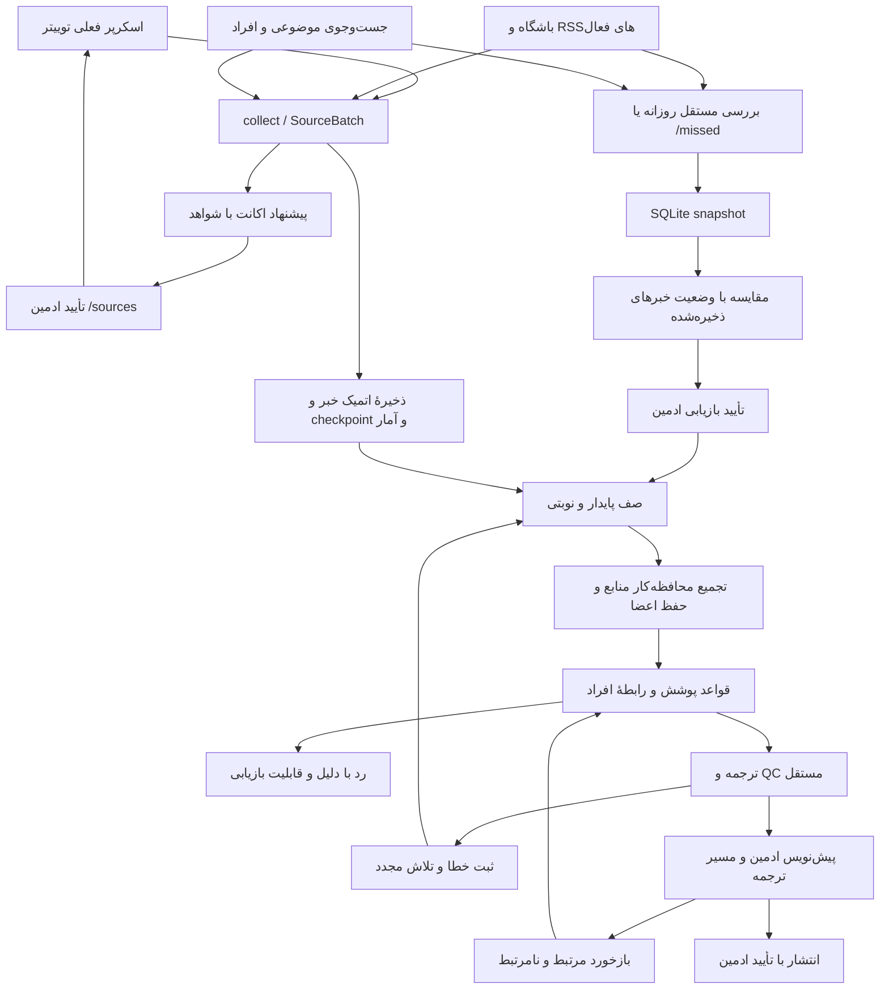

# کشف خبر و ابزارهای ادمین

این مسیر مستقل از Hermes است. endpoint، pagination، since و روش دریافت توییت
تغییر نکرده‌اند؛ تنها ثبت آمار هر اکانت و اضافه‌کردن اکانت‌های تأییدشده به نوبت
عادی دریافت افزوده شده است. خبر عمومی فقط با دکمهٔ انتشار ادمین ارسال می‌شود.

## تنظیمات

```env
ENABLE_OUTLET_RSS=true
OUTLET_RSS_SOURCES=all
OUTLET_RSS_MAX_AGE_HOURS=12
ENABLE_NEWS_SEARCH=true
NEWS_SEARCH_INTERVAL=300
```

RSSهای کاتالوگ و جست‌وجوی موضوعی به‌صورت پیش‌فرض روشن‌اند. مقدار خالی صریح
برای OUTLET_RSS_SOURCES یا false برای ENABLE_NEWS_SEARCH آن ورودی را خاموش
می‌کند. فایل env واقعی کاربر در این تغییر ویرایش نشده است. در پروداکشن مقادیر
بالا را تنظیم و سرویس را restart کنید. MAX_ITEMS_PER_CYCLE همچنان سقف پردازش
است؛ همهٔ آیتم‌های دریافت‌شده ابتدا ذخیره می‌شوند. پنجرهٔ ۱۲ ساعته فقط دامنهٔ
گزارش خبرهای جاافتاده است و خبر ذخیره‌شده را از صف حذف نمی‌کند.

پیش از اولین مهاجرت روی دیتابیس موجود، SQLite backup در پوشهٔ backups کنار
دیتابیس ساخته می‌شود و WAL را هم پوشش می‌دهد. برای استقرار نیز با سرویس خاموش
از پوشهٔ data و state نسخهٔ پشتیبان بگیرید. داده‌های جدید شامل snapshot منابع
مرجع، رابطهٔ افراد با تیم، ارجاع اکانت‌ها، آمار دریافت و شناسهٔ خبر اصلی است.

## دستورات

- `/queue` صف منتظر پردازش، بدون claim یا تغییر وضعیت؛ صفحه‌بندی و مشاهدهٔ خبر.
- `/queue review` پیش‌نویس‌های منتظر ادمین؛ فیلترهای failed، rejected، grouped و all هم موجودند.
- `/queue failed 2` صفحهٔ دوم خبرهای ناموفق؛ دکمهٔ بازیابی شمارندهٔ تلاش را صفر می‌کند.
- `/missed` یا `/missed refresh` بررسی مستقل سایت باشگاه، RSSهای فعال و جست‌وجوی موضوعی.
- `/missed 1` نمایش snapshot ذخیره‌شده بدون دریافت دوباره.
- `/accounts` زمان بررسی، زمان آخرین خبر دریافتی با تاریخ معتبر، تعداد دریافت خام، پاسخ خالی پیاپی و وضعیت‌های ۷ روز اخیر.
- `/sources` اکانت‌هایی که حداقل در دو خبر مرتبط از منابع مورداعتماد ارجاع گرفته‌اند، با لینک شواهد.
- `/sources watch NewReporter 7` تأیید پایش اکانت عمومی برای هفت روز.
- `/sources lfc NewReporter 7` تأیید اکانت اختصاصی لیورپول برای هفت روز.
- `/sources dismiss NewReporter` توقف پایش افزوده‌شده؛ حساب موجود در env را حذف نمی‌کند.
- `/watch target Full Name` هدف نقل‌وانتقال هفت‌روزه، با الزام متن مرتبط با انتقال و نبود خبر صرفاً مربوط به رقیب.
- `/watch current Full Name` بازیکن یا کادر فعلی؛ `/watch former Full Name` عضو سابق.
- `/watch remove Full Name` حذف رابطهٔ دستی؛ دریافت موفق فهرست رسمی دوباره رابطهٔ افراد فعلی را به‌روز می‌کند.
- `/merge ID1 ID2` تأیید دستی تجمیع خبر دوم زیر خبر اول. اعداد، نفی و شایعهٔ متفاوت اجازهٔ ادغام ندارند.
- `/health` ترتیب مدل‌ها و دلیل حذف اسلات ناقص یا مدل صوتی را هم نشان می‌دهد.

دکمهٔ «مرتبط» بازخورد را ذخیره می‌کند و خبر ردشده/ناموفق را به صف برمی‌گرداند.
«نامرتبط» جلوی انتشار بعدی همان خبر را می‌گیرد؛ پست قبلاً منتشرشده را از کانال
حذف نمی‌کند. بازخورد به‌صورت خودکار قاعدهٔ عمومی یا مدل آموزش‌دیده ایجاد نمی‌کند.
تمام این دستورات و دکمه‌ها همان ADMIN_USER_IDS موجود را رعایت می‌کنند؛ اگر آن
فهرست خالی باشد، کنترل دسترسی قبلی پروژه به همه اجازه می‌دهد.

## خبرهای جاافتاده و تجمیع

snapshot مرجع در جدول جدا ذخیره می‌شود و دریافت آن checkpoint توییتر را تغییر
نمی‌دهد. وجود همان URL در صف یا انتظار ادمین، پوشش محسوب می‌شود. خبرهای مرجع
با وضعیت failed/rejected/skipped قابل بازیابی‌اند. شکست ورودی‌ها در گزارش
نمایش داده می‌شود. اسکن روزانه در سرویس دائمی اجرا می‌شود؛ اجراهای once و
dry-run اسکن روزانه و پیام گزارش آن را راه نمی‌اندازند.

نام ناشر اصلی در نتیجهٔ جست‌وجوی موضوعی حفظ می‌شود؛ «News search» فقط هویت
مسیر دریافت است. اگر ناشر مشخص نباشد، نتیجه همچنان برای بازبینی حفظ می‌شود.

تجمیع خودکار محافظه‌کار است: متن کامل یکسان از دو منبع متفاوت، یا ارجاع مستقیم
به لینک خبر همراه با هم‌پوشانی قوی متن و ادعای یکسان. شباهت عنوان به‌تنهایی
خبر را پنهان نمی‌کند. matching در هر نوبت به ۱۰۰۰ ردیف ۴۸ ساعت اخیر محدود است؛
این سقف فقط بر تجمیع اثر دارد و هیچ دریافت یا پردازشی را حذف نمی‌کند. برای
بازنویسی‌های متفاوت، ادمین با /merge تصمیم می‌گیرد.

قبل از ترجمه، متن کامل‌تر و مدیای منابع تجمیع‌شده در خبر اصلی استفاده می‌شود؛
متن اصلی عضوها جدا حفظ می‌شود. نقل‌قول با گوینده، واحد پول یا قطعیت متفاوت
ادغام نمی‌شود. ویدیو یا عکس تازه‌ای که پس از ارسال پیش‌نویس برسد، برای بازبینی
در کارت جدا باقی می‌ماند. پس از ارسال پیش‌نویس یا انتشار، ترجمه و مدیای
آن بدون بازبینی تغییر نمی‌کنند؛ منابع تازه از دکمهٔ «منابع خبر» قابل مشاهده‌اند.
کیبورد قدیمی خبر تجمیع‌شده اجازهٔ انتشار دوباره نمی‌دهد.

این گزارش فقط پوشش منابع مرجع فعال را می‌سنجد. خبر با عنوان بازنویسی‌شده و URL
متفاوت ممکن است به‌عنوان پیشنهاد جاافتاده نمایش داده شود؛ پیش از بازیابی بررسی
کنید. دادهٔ اختصاصی توییت یا ویدیو هنوز به همان اسکرپر فعلی وابسته است. پاسخ
خالی fxembed علت دقیق خطای شبکه/اکانت را مشخص نمی‌کند و هیچ تعلیقی ایجاد نمی‌کند.
آمار اکانت‌های سایر حالت‌های اسکرپ هنوز ثبت نمی‌شود و گزارش این محدودیت را می‌گوید.

## بررسی

تست‌های `tests/test_news_discovery.py` بازیابی با تأیید، snapshot بدون تغییر
checkpoint، حفظ تمام ورودی‌ها، ادغام و عدم ادغام ادعاهای متفاوت، حفظ مدیا و
payload پس از restart/prune، انقضای پایش و رابطهٔ انتقال، کنترل دسترسی ادمین و
ثبت شکست و fallback زنجیرهٔ ترجمه را با شبکه/تلگرام شبیه‌سازی‌شده بررسی می‌کنند.

```powershell
$env:ADMIN_USER_IDS=''
python -m pytest tests -q
```

برای بررسی در گروه تست: /health، /queue، /accounts و /missed را اجرا کنید؛ یک
پیشنهاد را بازیابی کنید و رسیدن آن به پیش‌نویس را ببینید. سپس «نامرتبط» را بزنید
و مطمئن شوید انتشارش مسدود می‌شود. خبر مشابه با مبلغ یا نفی متفاوت باید جدا
بماند. تنظیم کلیدها یا endpoint اسکرپ برای این قابلیت‌ها لازم نیست.

## نقشهٔ مسیر جدید


